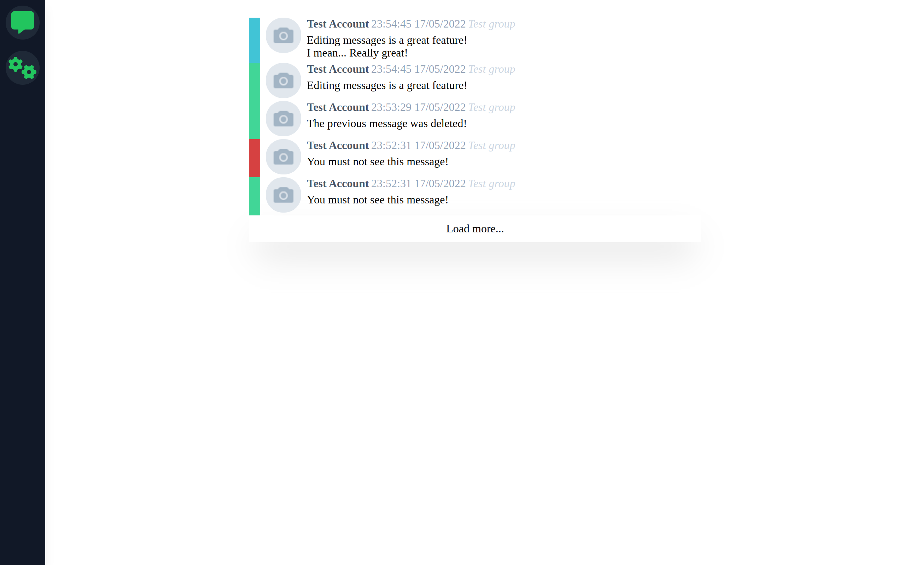

# big-brother

The purpose of this program is to save deleted and edited messages from VK.com


## Installation guide

### Manual installation

1. Install PostgreSQL and [Golang](https://go.dev/doc/install)
2. Clone this repository
3. Create necessary tables
<details>
    <summary>Code</summary>

```sql
CREATE TABLE IF NOT EXISTS users
(
    id SERIAL PRIMARY KEY,
    username VARCHAR (16) UNIQUE NOT NULL,
    password VARCHAR(60) NOT NULL,
    inviter_id serial NOT NULL
);

CREATE TABLE IF NOT EXISTS invite_codes (
    user_id serial PRIMARY KEY NOT NULL,
    invite_code varchar (10) UNIQUE NOT NULL,
    FOREIGN KEY (user_id) REFERENCES users(id)
);

CREATE TABLE IF NOT EXISTS user_tokens (
    user_id SERIAL PRIMARY KEY,
    access_token VARCHAR(100),
    FOREIGN KEY (user_id) REFERENCES users(id)
);

CREATE TABLE vk_tokens (
    access_token varchar (100) PRIMARY KEY,
    vk_user_id INTEGER NOT NULL
);

CREATE TABLE vk_messages (
    id SERIAL PRIMARY KEY,
    vk_owner_id INTEGER NOT NULL,
    message_id INTEGER NOT NULL,
    message JSONB
);

CREATE TYPE vk_message_event_type AS ENUM ('new', 'edit', 'delete');

CREATE TABLE vk_message_events (
    id SERIAL PRIMARY KEY,
    internal_message_id INTEGER NOT NULL REFERENCES vk_messages (id),
    m_type vk_message_event_type NOT NULL,
    created_at TIMESTAMP WITH TIME ZONE NOT NULL
);

CREATE TYPE vk_platform AS ENUM ('mobile', 'iphone', 'ipad', 'android', 'wphone', 'windows', 'web');
CREATE TYPE vk_activity AS ENUM ('online', 'offline');

CREATE TABLE vk_activity_events (
    id SERIAL PRIMARY KEY,
    vk_owner_id INT NOT NULL,
    target_id INT NOT NULL,
    activity vk_activity NOT NULL,
    platform vk_platform,
    kicked_by_timeout BOOLEAN,
    created_at TIMESTAMP WITH TIME ZONE NOT NULL
);

INSERT INTO users (username, password, inviter_id)
VALUES ('admin', '$2a$14$eq/wtfqDX3v5sTgHrts4dOq8osb0BA0ltJyGjOHM5Y49Wg1S9D6LK', 0);

INSERT INTO invite_codes (user_id, invite_code)
VALUES (1, 'POfdEpmuRg')
```

</details>

4. Edit `config.yml` file
5. Run program `go run cmd/big-brother/main.go`
6. Now you can log in (login: `admin`, password: `AdminAdminAdmin123`, invite code: `POfdEpmuRg`)